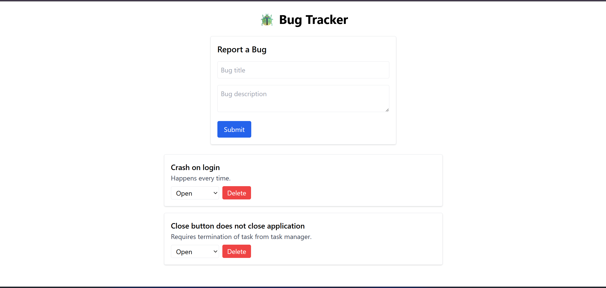
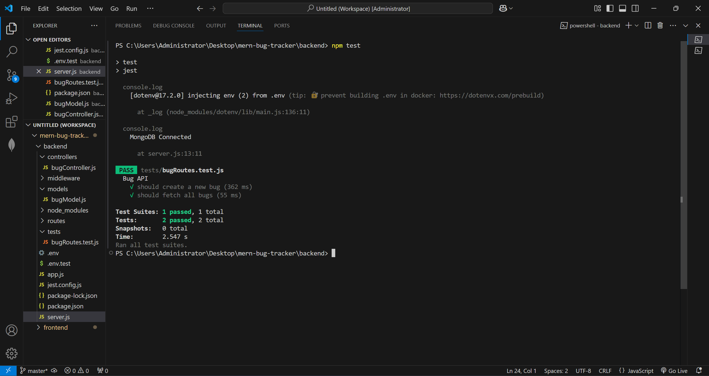
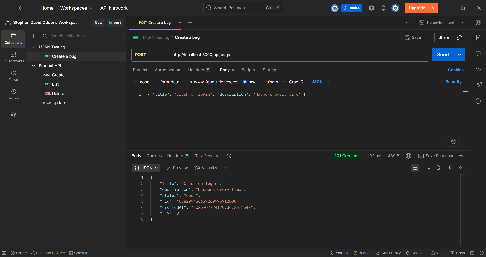
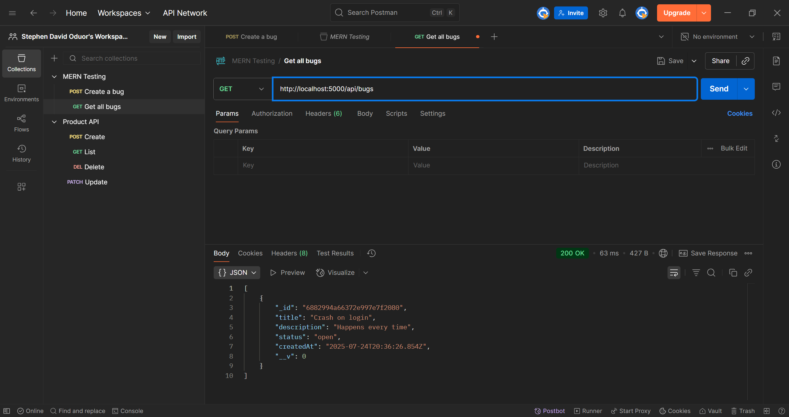
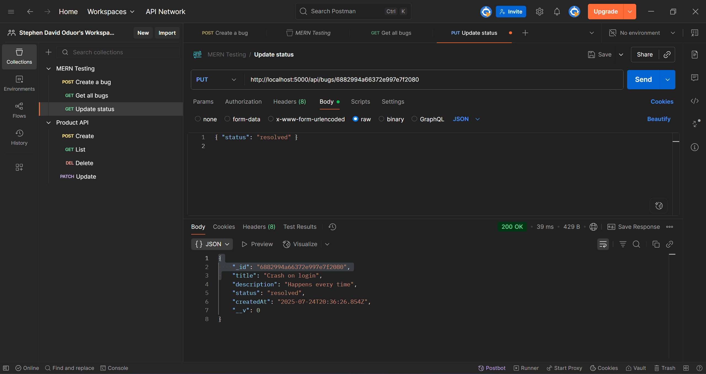
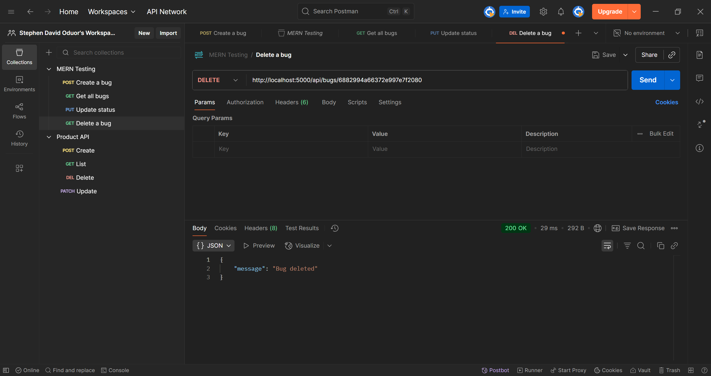
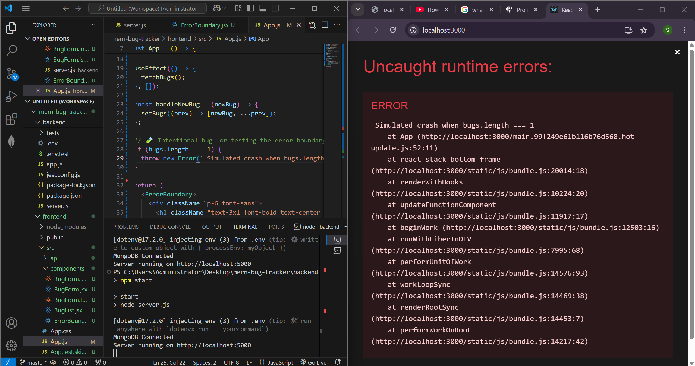
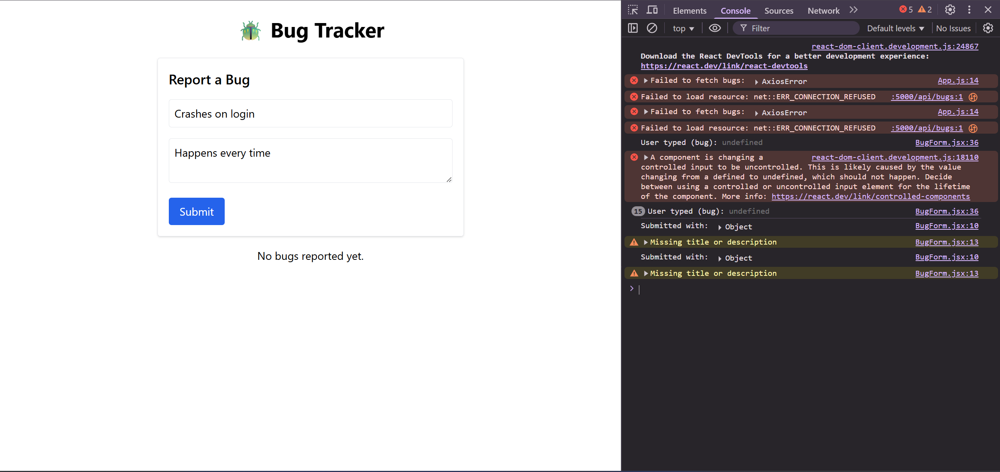

# 🐞 MERN Bug Tracker

A simple yet fully-tested **MERN stack bug tracking application** that allows users to report, view, and manage bugs. This project emphasizes robust development practices including **API testing with Postman**, **unit and integration tests**, **debugging tools**, **error boundaries**, and comprehensive **error handling**.

---

## 🚀 Features

- Create, view, and delete bug reports
- RESTful API using Express & MongoDB
- Client-side form and bug list using React
- Testing with **Jest**, **Supertest**, and **React Testing Library**
- Error boundaries to handle frontend crashes
- Full debugging workflow with tools like **DevTools**, **Node Inspector**, and **console logs**
- Modular code with reusable components and middleware

---

## 📁 Project Structure

```
mern-bug-tracker/
├── backend/
│   ├── controllers/
│   ├── models/
│   ├── routes/
│   ├── middleware/
│   ├── tests/               # Backend Jest & Supertest files
│   └── server.js
├── frontend/
│   ├── src/
│   │   ├── api/
│   │   ├── components/
│   │   ├── App.js
│   │   └── index.js
│   ├── public/
│   └── package.json
└── README.md
```

---

## 🛠️ Installation & Setup

### 🔧 Backend Setup

```bash
cd backend
npm install
```

**.env file:**

```
PORT=5000
MONGO_URI=your_mongodb_connection_string
```

Start the backend:

```bash
npm run dev
```

### 💻 Frontend Setup

```bash
cd frontend
npm install
npm start
```

---

## 🔌 API Testing with Postman

Before integrating the frontend, the API was manually tested using [Postman](https://www.postman.com/). Key tests:

- **POST /api/bugs** → Create bug with title & description
- **GET /api/bugs** → Retrieve all bugs
- **DELETE /api/bugs/:id** → Remove a bug

Each route was tested with various inputs to verify validation and error handling responses.

---

## ✅ Testing Strategy

### 📦 Backend Tests (Unit + Integration)

- **Tools:** Jest + Supertest
- **Location:** `backend/tests/`

We mocked Mongoose models and tested:

- Controller logic (`createBug`, `getBugs`, `deleteBug`)
- API routes with real HTTP requests using `supertest`
- Validation scenarios and error branches

```bash
cd backend
npm test
```

---

### 🧪 Frontend Tests

- **Tools:** Jest + React Testing Library
- **Location:** `frontend/src/components/*.test.jsx`

#### Component Unit Tests:
- `BugForm.test.jsx` verifies:
  - Controlled inputs work
  - Submitting with empty fields is blocked
  - Submitting with valid input triggers API call

#### Integration Tests:
- `BugForm.integration.test.jsx` simulates the real form with mocked axios
- Handled edge cases like async failures and validation

```bash
cd frontend
npm test
```

---

## 🪛 Debugging Techniques

### ✅ 1. Console Logs
We added `console.log()` in:
- API requests (`bugApi.js`)
- Submission handlers (`BugForm`)
- Backend controllers

Used to trace values and logic flow during development.

---

### ✅ 2. Chrome DevTools
- Inspected React component props & state
- Monitored network requests (especially Axios errors and status codes)
- Used **React Developer Tools** extension for in-depth debugging

---

### ✅ 3. Node.js Inspector
We used:

```bash
node inspect server.js
```

To step through backend logic, breakpoints, and error paths.

---

## ⚠️ Error Handling

### Backend
Centralized error middleware in Express:

```js
app.use((err, req, res, next) => {
  console.error(err.stack);
  res.status(500).json({ message: 'Server error' });
});
```

### Frontend
Added **React Error Boundary** to catch crashes without breaking the app.

```jsx
class ErrorBoundary extends React.Component {
  ...
}
```

Wrapped `<App />` with:

```jsx
<ErrorBoundary>
  <App />
</ErrorBoundary>
```

✅ We even simulated a crash to verify it renders the fallback UI!

---

## 🌐 CORS & Axios Setup

Handled the common CORS issue:

```
Access to XMLHttpRequest at 'http://localhost:5000' ... blocked by CORS policy
```

### Backend fix:

```js
const cors = require('cors');
app.use(cors());
```

### Axios Base URL:

```js
const API_BASE = 'http://localhost:5000/api/bugs';
```

---

## 🖼️ Screenshots

Here are a few screenshots showing the tests.

### ✅ UI



### ✅ Tests



### ✅ Postman API Requests









### 🧯 Error Boundary Working



### Dev Tools Error Handling



---

## 📌 Known Limitations

- No authentication/authorization yet
- Bugs are not user-specific
- No database pagination or filtering

---

## 🗂️ Future Improvements

- Add user auth (JWT)
- Update bug status (open, resolved)
- Sort/filter/search bugs
- Deployment via Vercel (frontend) & Render/Fly.io (backend)

---

## 🧾 License

MIT © [Stephen David Oduor]

---

## 🙌 Acknowledgements

- [React Testing Library Docs](https://testing-library.com/)
- [Jest](https://jestjs.io/)
- [MongoDB](https://www.mongodb.com/)
- [Supertest](https://github.com/visionmedia/supertest)

---

## 📬 Contact

For questions or contributions, open an issue or PR on [GitHub](https://github.com/stevie-dave/mern-bug-tracker).

